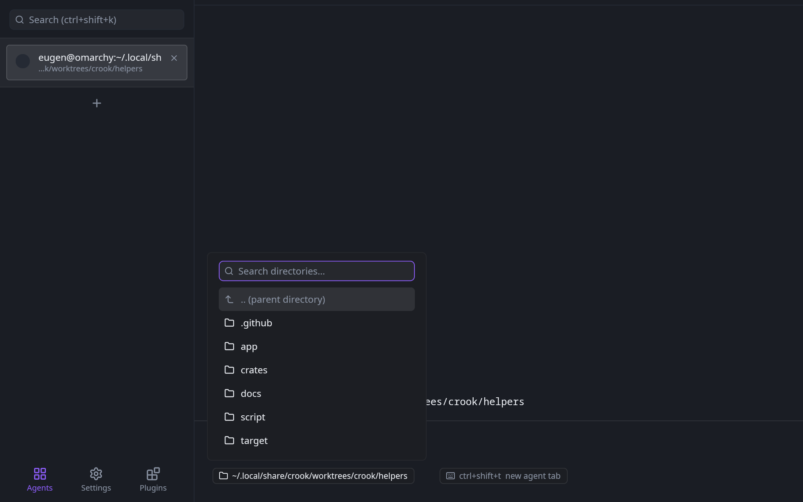
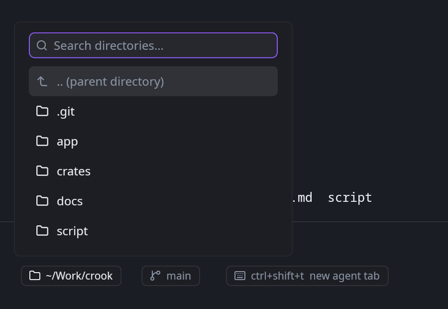
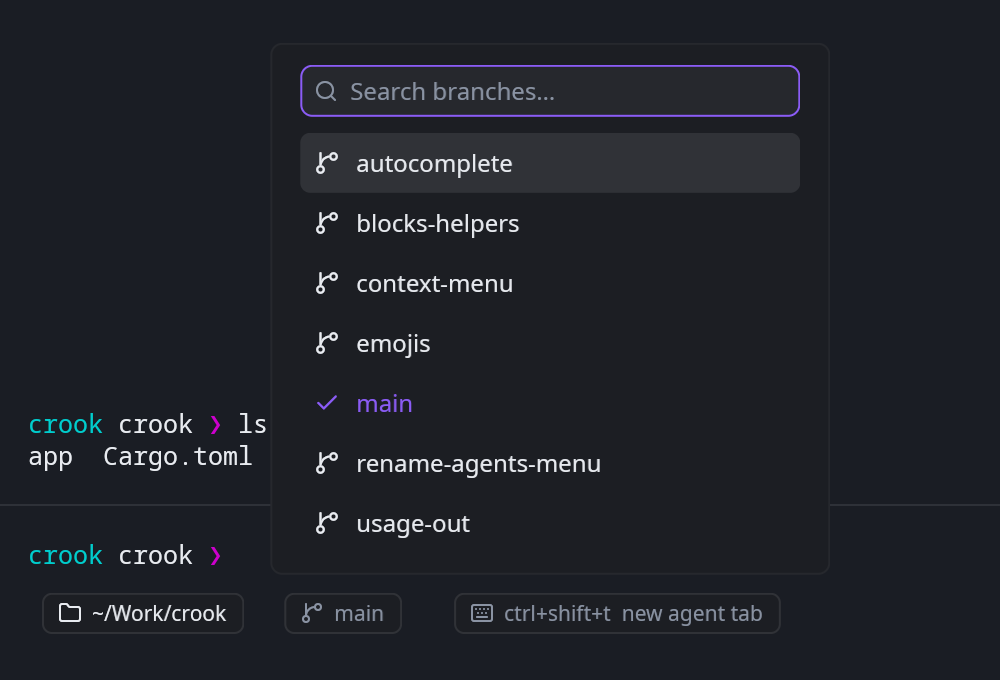

# Chips

Where the pane is, what branch it is on, and what a chord would do — the row under the line
you are typing in [Crook](https://github.com/theguriev/crook), as a plugin Crook does not
carry.



Four things, each of them a chip:

- **the directory**, `~/Work/crook`, and a picker under it: a field, the way up, and every
  directory under this one. Choosing a row types `cd` into your shell;
- **the branch**, and a picker of every branch the repository has. Choosing one types
  `git switch`;
- **what has changed**, `+12 −3`, when anything has;
- **a chord** — what starts a new agent tab — which runs it when pressed, and offers
  *Change keybinding* on its secondary click.

Where a program has taken the screen — an agent, `vim`, `top` — the row floats over the
pane's bottom corner instead, which is where Warp puts it and where it is out of the way.

| | |
|---|---|
|  |  |

Both panels are Crook's own: a field, a filtered list, arrows, Enter and Escape. This plugin
supplies the rows and is told which one was chosen.

## What it is allowed to do

Four sentences, and it can do nothing else. They are in the manifest, a person answers them
on Crook's Plugins page, and everything not on the list comes back refused rather than
failed:

| it asks to | so that |
|---|---|
| see which project the active pane is in | the chips can say where you are |
| see the names of the files in `~` | the directory picker has rows |
| type `cd …` and `git switch …` into your shell | choosing a row does something |
| use `crook/window/new-tab` and `crook/shortcuts/rebind` | the chord chip runs and rebinds |

**It never sees a keystroke.** The picker's field, its filtering, its arrow keys, Enter and
Escape are Crook's: this plugin says what can be chosen and is told which row a person chose.
It cannot read what you type into that field, and it cannot read what you type anywhere else.

**It cannot type whatever it likes.** `cd {}` and `git switch {}` are the exact strings it
asked for; Crook fills the hole and quotes what goes in it, so a branch named `; rm -rf ~` is
a branch name. And it may only type at all in the moment somebody pressed something — never
on a timer, never while nobody is looking.

**It cannot change a keybinding.** It asks Crook to, by name, and Crook puts up its own
recorder.

**Needs a Crook that speaks plugin API 6.** An older one refuses this by number, at load, with
a line saying which version each side speaks.

## Installing

```sh
cargo build --release --target wasm32-unknown-unknown -p chips
crook --install-plugin target/wasm32-unknown-unknown/release/chips.wasm
```

Or copy `chips.wasm` to `<data>/crook/plugins/theguriev.chips/plugin.wasm` by hand —
`~/.local/share` on Linux, `~/Library/Application Support` on macOS, `%APPDATA%` on Windows.
Then open **Plugins** in the sidebar and answer what it asks for; a chip that has not been
allowed something says so in its own panel rather than failing quietly.

## Building on it

```sh
cargo test        # everything but the imports, on your own machine
cargo clippy --all-targets
```

`crates/chips/src/sys.rs` is the only file that touches the six imports a sandboxed plugin
has; off wasm they are stubs that record what was asked for, which is what lets the state
machine in `state.rs` and the tree in `view.rs` be tested by `cargo test` rather than by
installing a plugin and squinting at a terminal.

`crates/crook_plugin_api` is a **copy** of that crate from Crook itself, vendored because a
plugin anybody can build cannot depend on a repository they cannot clone. `ABI_VERSION` keeps
the two honest: a copy that has drifted is a plugin the host refuses by number, at load, with
a line saying which version each side speaks.

## Releasing

A release is a tag, and the tag is cut by a script:

```sh
./script/release 0.2.1 --push
```

It sets the version in `Cargo.toml`, writes the `## v0.2.1` section of `CHANGELOG.md`
from the commit titles since the previous tag with
[changelogen](https://github.com/unjs/changelogen), commits both as `chore(release):
v0.2.1`, tags it and pushes. `ci.yml` builds `plugin.wasm` from that tag and puts it on a
release page whose notes are that same section — written once, not once for the file and
again for the page. `--dry-run` prints the section and stops; `--push` is what starts the
build.

Which makes commit titles the release notes, so they are [Conventional
Commits](https://www.conventionalcommits.org/en/v1.0.0/) — `feat(panel): …`, `fix: …`, the
types listed under `types` in `changelog.config.json`. A title in any other shape is not an
error to the generator, it is dropped without a word, so it is refused where it is still
easy to fix: `git config core.hooksPath script/hooks` installs the hook, and `commits.yml`
runs the same check on every pull request. The history before all this predates the convention,
so the first release over it needs `--allow-untyped`, which says the omission is understood.

## Licence

MIT. The icons it names by name are Crook's own, drawn by Crook — this plugin ships no
artwork, no colours and no pixels.
